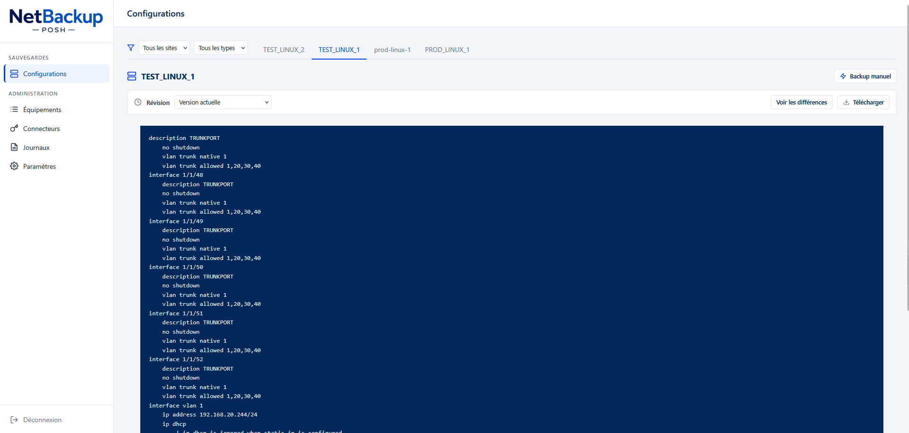
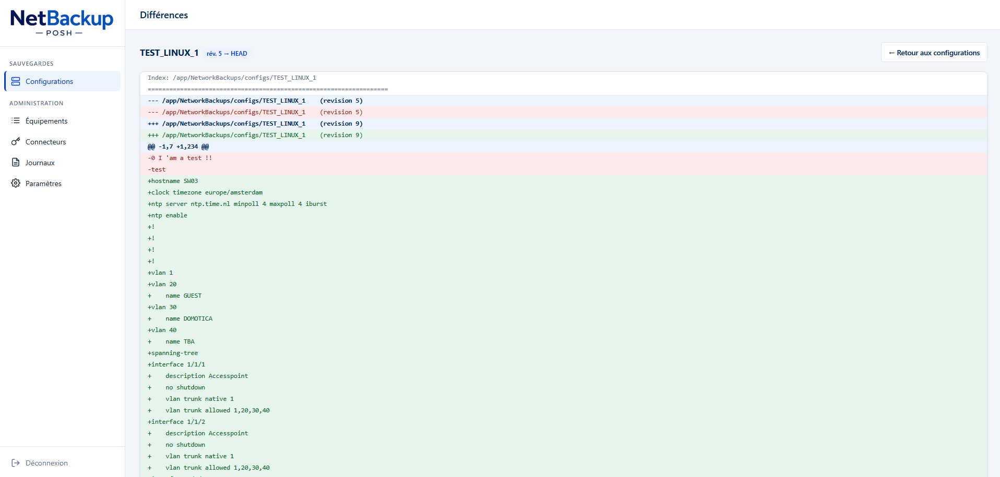

# 📦 NetBackup-PowerShell

NetBackup-PowerShell est un projet PowerShell embarqué dans un conteneur Docker léger basé sur Alpine, permettant d'automatiser la récupération, la sauvegarde et le suivi de version des configurations d'équipements réseau (switchs, routeurs, etc.).

---

## 🚀 Fonctionnalités principales

- 🔐 Authentification aux équipements via des **connecteurs** (mot de passe ou clé SSH) gérés dans l'admin, secrets chiffrés en `SecureString`
- 📡 Connexion SSH aux équipements (via Posh-SSH)
- 📝 Exécution de commandes personnalisées pour chaque équipement
- 💾 Sauvegarde des configurations dans `/app/NetworkBackups/configs`
- 📁 Suivi des versions avec `svn`
- 🌐 Interface web locale sur le port `8080` pour visualiser les configurations et leurs révisions, protégée par un login admin
- 🛠️ Espace admin (`/admin`) : gestion de `devices.json`, connecteurs d'authentification (mot de passe ou clé SSH), consultation des logs de backup, déclenchement d'un backup manuel
- 📆 Tâche cron intégrée pour exécuter les backups toutes les heures

---

## 🧰 Structure du projet

```text
.
├── app
│   ├── Backup-Network.ps1        # Script principal de sauvegarde
│   ├── New-AdminHash.ps1         # Génère ADMIN_PASSWORD_HASH (Argon2)
│   ├── devices.json              # Liste des équipements à sauvegarder
│   ├── NetworkBackups/          # Dossier de backup SVN
│   ├── assets/
│   │   ├── styles/style.css     # Style de l'interface Web
│   │   ├── scripts/app.js       # Comportement JS de l'interface Web
│   │   └── img/                 # banner.png, favicon.ico, logo.png
│   ├── src/
│   │   ├── Handle-Conf.ps1       # Rendu des configs (/conf)
│   │   ├── Handle-Diff.ps1       # Rendu des diffs (/diff)
│   │   ├── Handle-Auth.ps1       # Sessions, login/logout
│   │   ├── Handle-Admin.ps1      # Espace admin (/admin)
│   │   ├── Handle-Connectors.ps1      # Connecteurs SSH (/admin/connectors)
│   │   ├── Argon2.ps1                 # Hachage Argon2 du mot de passe admin
│   │   ├── Handle-Settings.ps1        # Paramètres (/admin/settings)
│   │   └── Utils.ps1             # Fonctions utilitaires
│   ├── Web.ps1                   # Serveur HTTP (interface web)
│   └── bootstrap.ps1            # Script de démarrage global
└── Dockerfile
```

---

## ⚙️ Utilisation

### 1. 🔨 Construction de l’image Docker
```bash
docker build -t bckp_posh-alpine .
```

### 2. ▶️ Lancement du conteneur
```bash
docker run --env-file .env -p 8080:8080 -v ./NetworkBackups:/app/NetworkBackups -v ./devices.json:/app/devices.json -v ./secrets:/app/secrets bckp_posh-alpine
```

fichier .env exemple :
```bash
ADMIN_USER=admin
ADMIN_PASSWORD_HASH=$argon2id$v=19$m=65536,t=3,p=4$...
WEB_PREFIX=http
WEB_ADDR=127.0.0.1
PUB_URL=http://localhost:8080
WEB_PORT=8080
```

⚠️ `ADMIN_USER`/`ADMIN_PASSWORD_HASH` sont **obligatoires** : toute l'interface web (`/conf`, `/diff`, `/admin`) est protégée par un login, sans ces variables la connexion admin est impossible.

Le mot de passe admin est stocké **haché en Argon2id** (plus de mot de passe en clair dans `.env`). Générez le hash avec l'outil fourni :

```bash
docker run --rm -it bckp_posh-alpine pwsh /app/New-AdminHash.ps1
```

puis collez la ligne `ADMIN_PASSWORD_HASH=...` affichée dans votre `.env` (telle quelle, **sans guillemets** — le format `--env-file` de Docker prend la valeur littéralement ; en shell `export`/`docker -e`, entourez au contraire la valeur de quotes simples à cause des `$`). L'ancienne variable `ADMIN_PASSWORD` (en clair) reste acceptée en repli mais est dépréciée et journalise un avertissement.

### 3. 📝 Vérifiez les logs
```bash
docker exec -it <container_id> tail -f /var/log/backup.log
```

La console du conteneur (`docker logs`) ne montre que l'essentiel (équipement traité, réussite/échec, résumé). Le détail complet (connexions SSH, lectures, tailles...) est écrit dans `/var/log/backup.log` par les runs cron et les backups manuels, exécutés avec `-Verbose`.

Cela effectue :
- Lancement du script de backup initial (`Backup-Network.ps1`)
- Planification d’un cron pour l’exécuter toutes les heures
- Lancement de l’interface Web sur `http://0.0.0.0:8080`

---

## 🌐 Interface Web

Accessible via : [http://localhost:8080](http://localhost:8080) — redirige vers `/login` tant qu'aucune session n'est ouverte.

L'interface reprend les codes d'un panneau d'administration moderne (inspiration Cloudflare) : navigation latérale (Sauvegardes / Administration), barre supérieure avec titre de page, contenu en cartes — le tout aux couleurs bleues du logo Aresia.

Fonctionnalités (`/conf`, après connexion) :
- Liste des équipements sauvegardés
- Visualisation des configurations actuelles
- Sélecteur de révisions SVN
- Filtre pour les équipements (selectionner par site ou par os)
- Afficher seulement les différences entre une version et la plus actuelle
- Backup manuel de l'équipement sélectionné (bouton sur chaque onglet, exécute `Backup-Network.ps1 -DeviceName <nom>` en arrière-plan)

### 🔑 Authentification et espace admin

- `/login` : formulaire de connexion (`ADMIN_USER` + mot de passe vérifié contre `ADMIN_PASSWORD_HASH`, Argon2id), pose un cookie de session. Anti-brute-force : après 5 échecs depuis une même IP, le login est verrouillé 5 minutes.
- `/logout` : invalide la session en cours.
- `/admin` : dashboard donnant accès à :
  - `/admin/devices` : gestion des équipements via un formulaire dynamique (ajout, modification, suppression). Les champs Site et Type proposent les valeurs existantes plus une option « Nouveau… ». Les changements sont appliqués côté navigateur puis persistés d'un bloc via « Enregistrer les modifications » (une sauvegarde `devices.json.bak` est faite avant chaque écriture)
  - `/admin/connectors` : gestion des **connecteurs d'authentification** — couples identifiant/mot de passe ou clés SSH (PEM/OpenSSH, passphrase optionnelle). Chaque équipement référence **obligatoirement** un connecteur via sa propriété `Connector` (sélecteur dans le formulaire Équipements) — c'est l'unique mécanisme d'authentification aux équipements. Les secrets sont stockés via `Export-Clixml` avec mots de passe, clés privées et passphrases en `SecureString`, dans `/app/secrets/connectors.xml` (fichier en `600`, monter `/app/secrets` en volume pour la persistance). Aucune clé n'est écrite en clair sur le disque : elle est matérialisée en tmpfs (`/dev/shm`) uniquement le temps de la connexion SSH. Les secrets ne sont jamais renvoyés au navigateur, et un connecteur utilisé par un équipement ne peut pas être supprimé. Un ancien `connectors.json` (format v1) est migré automatiquement au premier affichage de l'admin.
  - `/admin/logs` : consulter les 200 dernières lignes de `/var/log/backup.log`
  - `/admin/settings` : **paramètres** — changement du mot de passe admin (vérification de l'actuel, re-haché en Argon2id, les autres sessions sont déconnectées) et édition des variables (`ADMIN_USER`, `PUB_URL`, `WEB_PREFIX`, `WEB_ADDR`, `WEB_PORT`). Les valeurs définies ici sont stockées dans `/app/secrets/settings.json` (600) et **priment sur les variables d'environnement** ; un champ vide revient à la variable d'environnement. Les variables d'écoute web (↻) sont prises en compte au redémarrage du conteneur.

Le backup manuel se déclenche depuis la page Configurations, pour l'équipement sélectionné uniquement.

Sans session valide, toutes les routes (sauf `/login`) redirigent vers la page de connexion.

### Capture d'écran de l'interface



*Exemple de l'interface de sauvegarde avec affichage d'une configuration d'équipement réseau*



*Exemple de l'interface de sauvegarde avec affichage des différences d'un équipement réseau*

---

## 📝 Fichier `devices.json` exemple

```json
{
  "devices": [
    {
      "Name": "SW_PROD_1",
      "IP": "192.168.2.1",
      "Type": "comware",
      "Site": "Paris01",
      "Connector": "prod-admin",
      "Commands": [
        "screen-length disable\n display current-configuration"
      ]
    },
    {
      "Name": "SW_PROD_2",
      "IP": "192.168.2.2",
      "Type": "aruba",
      "Site": "Paris01",
      "Connector": "prod-admin",
      "Commands": [
        "no page\n show running-config"
      ]
    }
  ]
}
```

---

## 🛠️ Dépendances

- PowerShell Core (via Alpine)
- `Posh-SSH`
- `subversion` & `svnadmin`
- `cron`

---

## 📬 Contact
Projet maintenu par [Alternants DSI Aresia VLT] 
